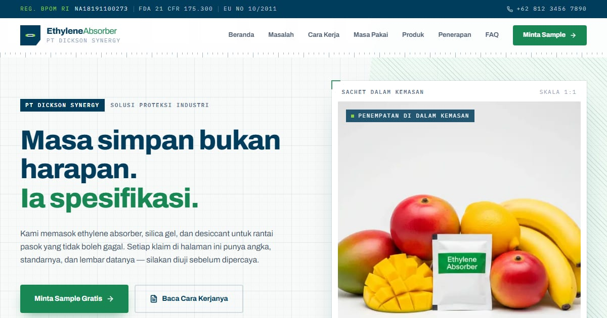

# EthyleneAbsorber — Konsep Korporat | Dickson Synergy

Penyedia solusi proteksi industri: ethylene absorber, silica gel, dan desiccant bersertifikat untuk rantai pasok komoditas segar.

**Demo live:** https://absorber-dickson.vercel.app



> Konsep desain untuk kontes brief EthyleneAbsorber (PT Dickson Synergy), bukan situs resmi perusahaan. Formulir di dalamnya tidak mengirim data.

## Konsep

Konsep "Korporat" dengan bahasa rupa **Lembar Data**: grid milimeter, rel penggaris, dan arsiran seperti gambar teknik, karena setiap klaim punya angka dan standar. Bagian khasnya adalah rel indikator KMnO₄ (ungu ke cokelat) yang menunjukkan satu sachet cukup untuk seluruh pelayaran laut.

## Halaman

`/` · `/faq` · `/kontak` · `/privacy` · `/terms`

## Teknologi

- Next.js 15.5 (App Router) dan React 19
- Tailwind CSS v4
- TypeScript
- Framer Motion, Lucide (ikon)
- Font: Archivo, IBM Plex Mono (next/font)
- SEO: metadata per halaman, Open Graph, JSON-LD, sitemap.xml, dan robots.txt

## Menjalankan secara lokal

```bash
npm install
npm run dev
```

Buka http://localhost:3000. Untuk build produksi: `npm run build` lalu `npm start`.

---

Bagian dari koleksi 9 entri kontes desain web di [PortalKontes](https://www.pintuweb.com/kontes-desain). Dibuat oleh [PintuWeb](https://www.pintuweb.com), jasa pembuatan website.
